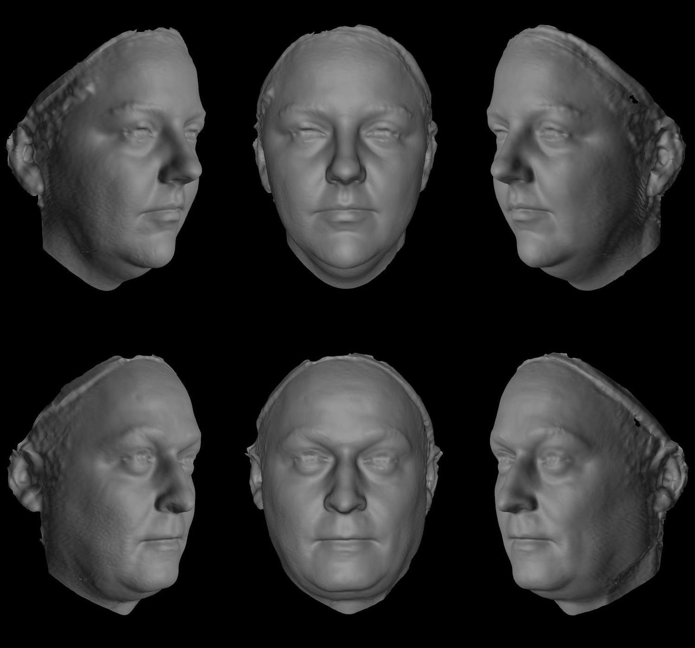

## HOUSEKEEPING
```{r housekeeping, message=FALSE}
#-- Load libraries
library(tidyverse)
library(broom)
library(knitr)
library(kableExtra)
library(geomorph)
library(ICC)
library(caret)
library(viridis)
library(lme4)
library(lmerTest)
library(rgl) # 3D plots
library(alphashape3d) # visualizing 3D meshes
library(png)
library(cowplot)
library(GGally)
library(ggpubr)
library(magick)

#install.packages("devtools")
#devtools::install_github("GRousselet/rogme")
library(rogme) # shift analysis

#-- Load custom functions
source("./dataFiles/_customFunctions_coupleRes_2019-11-13.R")
```

# SAMPLE DESCRIPTIVES
Three-dimensional images were collected as part of a bigger project on how family resemblance shows in the face (KINSHIP, https://osf.io/bvtnj).
```{r read-demo, message=FALSE, echo=FALSE}
demo.raw <- read_csv("./dataFiles/demographics_anon.csv")

### Create list of couple IDs
couple.ids <- demo.raw %>%
  select(f.partner, m.partner, couple.id)
```

```{r participant-age}
age.summary <- demo.raw %>%
  gather(key = sex, value = id, f.partner, m.partner) %>%
  mutate(sex = recode(sex, "f.partner" = "Women", "m.partner" = "Men"),
         sex.f = factor(sex, levels = c("Women", "Men"))) %>%
  mutate(age = ifelse(sex == "Women", f.age, m.age)) %>%
  select(id, age, sex.f) %>%
  group_by(sex.f) %>%
  summarise(
    age_median = median(age,na.rm = TRUE),
    age_mean = round(mean(age, na.rm = TRUE), 1),
    age_SD = round(sd(age, na.rm = TRUE), 1),
    missing = sum(is.na(age))
  )
```

```{r rel-length}
rlength.summary <- demo.raw %>%
  summarise(
    r.length.min = round(min(r.length, na.rm = TRUE), 1),
    r.length.max = round(max(r.length, na.rm = TRUE), 1),
    r.length.M = round(mean(r.length, na.rm = TRUE), 1),
    r.length.SD = round(sd(r.length, na.rm = TRUE), 1),
    missing = sum(is.na(r.length))
            )
```

Participants were 178 White men (aged M±SD=`r age.summary[which(age.summary$sex.f=="Men"),]$age_mean`±`r age.summary[which(age.summary$sex.f=="Men"),]$age_SD`) and 178 White women (aged M±SD=`r age.summary[which(age.summary$sex.f=="Women"),]$age_mean`±`r age.summary[which(age.summary$sex.f=="Women"),]$age_SD`) in romantic relationships (relationship length ranged from less than a year to 52 years, M±SD=`r rlength.summary$r.length.M`±`r rlength.summary$r.length.SD` years). Participation was voluntary and each participant provided their informed written consent.

```{r}
age.summary %>%
  kable() %>%
  kable_styling()
```

```{r participant-age-plot}
demo.raw %>%
  gather(key = sex, value = id, f.partner, m.partner) %>%
  mutate(sex = recode(sex, "f.partner" = 0, "m.partner" = 1)) %>%
  mutate(age = ifelse(sex == 0, f.age, m.age),
         sex = ifelse(sex == 0, "Women", "Men"),
         sex.f = factor(sex, levels = c("Women", "Men"))) %>%
  select(id, age, sex.f) %>%
  filter(!is.na(age)) %>%
  ggplot(aes(x = age, group = sex.f, color = sex.f, fill = sex.f)) +
  theme_classic() +
  theme(axis.ticks.y = element_blank(),
        axis.text.y = element_blank()) +
  geom_density(alpha = .5, lwd = .8) +
  scale_x_continuous(breaks=seq(20, 80, 5)) +
  labs(y = "Density", x = "Participant age") +
  geom_vline(data = age.summary,
             aes(xintercept = age_median, color=sex.f),
             linetype="dashed",
             size = .8,
             show.legend = FALSE) +
  geom_text(data = age.summary,
            aes(label = age_median, y=.051, x=age_median+1.5),
            show.legend = FALSE) +
  guides(color = guide_legend("Sex"), fill = guide_legend("Sex"))
```

```{r}
rlength.summary %>%
  kable() %>%
  kable_styling()
```

```{r rel-length-plot}
ggplot(filter(demo.raw, !is.na(r.length)), aes(x = r.length)) +
  theme_classic() +
  theme(legend.position = "none",
        axis.ticks.y = element_blank(),
        axis.text.y = element_blank()) +
  geom_density(alpha = 0.5, lwd = 0.8, fill = "gray") +
  labs(x = "Relationship length (years)",
       y = "Density") +
  geom_vline(data = rlength.summary,
             aes(xintercept=r.length.M),
             linetype = "dashed",
             size = .8,
             show.legend = FALSE) +
  geom_text(data = rlength.summary,
            aes(label = r.length.M, y = .051, x = r.length.M + 1.5),
            show.legend = FALSE)
```

# CREATING CONTROL DISTRIBUTION
In order to create a control distribution, we found all possible pairings between each woman and all men in the set who were within five years of her actual partner's age. Analyses with men as target individuals show the same pattern of results. As men and women within and between couples were of different ages, number of control pairings for women and men varied. For each woman in the sample, a minimum of two and a maximum of 91 male controls was available (median N=71); for each man, a minimum of two and a maximum of 83 male controls was available (median N=64; see figure below).

## Replace missing ages
For six participants, no information on age was available. In order not to lose those six couples, the mean age difference between female and male partners was calculated, and missing ages of men/women replaced with the partner's age +/- the mean age difference.

```{r replace-missing-ages}
#-- Calculate mean age difference
M_age.diff <- demo.raw %>%
  mutate(age.diff = m.age - f.age) %>%
  summarise(age.diff.m = round(mean(age.diff, na.rm = TRUE), 0)) %>%
  pull(1)

#-- Replace missing ages
demo<-demo.raw %>%
  mutate(
    f.age.new = ifelse(!is.na(f.age), f.age, (m.age - M_age.diff)),
    m.age.new = ifelse(!is.na(m.age), m.age, (f.age + M_age.diff)) 
  )

#-- Convert age to long format for later
age <- demo %>%
  gather(key = sex, value = id, f.partner, m.partner) %>%
  mutate(sex = recode(sex, "f.partner" = 0, "m.partner" = 1)) %>%
  mutate(age = ifelse(sex == 0, f.age.new, m.age.new)) %>%
  select(id, age, sex)
```

## Calculate age boundaries
```{r calc-age-bound, message=FALSE}
demo <- demo %>%
  mutate(
    f.age.min = (f.age.new - 5),
    f.age.max = (f.age.new + 5),
    m.age.min = (m.age.new - 5),
    m.age.max = (m.age.new + 5)
  )
```

## Limit control sample according to age restrictions
```{r limit-age}
#--  All possible combinations
all.comb <- expand.grid(fem = demo.raw$f.partner,
                        mal = demo.raw$m.partner,
                        stringsAsFactors = FALSE
) %>%
  rowid_to_column("pairing.id")

#-- Creating male control sample for female targets
maleControls <- all.comb %>%
  left_join(demo, by = c("fem" = "f.partner")) %>%
  rename(fem.age = f.age.new,
         fem.partner.age = m.age.new,
         fem.partner.min.age = m.age.min,
         fem.partner.max.age = m.age.max
  ) %>%
  select(fem, mal, pairing.id, fem.age, fem.partner.min.age, fem.partner.max.age) %>%
  left_join(age, by = c("mal"="id")) %>%
  select(-sex) %>%
  rename(mal.age = age) %>%
  filter(mal.age >= fem.partner.min.age & mal.age <=fem.partner.max.age) %>%
  left_join(couple.ids, by = c("fem" = "f.partner", "mal" = "m.partner"))

#-- Creating female control sample for male targets
femaleControls <- all.comb %>%
  left_join(demo, by = c("mal" = "m.partner")) %>%
  rename(mal.age = m.age.new,
         mal.partner.age = f.age.new,
         mal.partner.min.age = f.age.min,
         mal.partner.max.age = f.age.max
  ) %>%
  select(fem, mal, pairing.id, mal.age, mal.partner.min.age, mal.partner.max.age) %>%
  left_join(age, by = c("fem" = "id")) %>%
  select(-sex) %>%
  rename(fem.age = age) %>%
  filter(fem.age >= mal.partner.min.age & fem.age <= mal.partner.max.age) %>%
  left_join(couple.ids, by = c("fem" = "f.partner", "mal" = "m.partner"))
```

## Control sample size
```{r control-sample, echo=FALSE}
female.matches <- maleControls %>%
  filter(is.na(couple.id)) %>%
  group_by(fem) %>%
  summarise(N = n()) %>%
  rename(id = fem) %>%
  mutate(Target = "Women")

male.matches <- femaleControls %>%
  filter(is.na(couple.id)) %>%
  group_by(mal) %>%
  summarise(N = n()) %>%
  rename(id = mal) %>%
  mutate(Target = "Men")

rbind(female.matches, male.matches) %>%
  group_by(Target) %>%
  summarise(N_min = min(N),
            N_max = max(N),
            N_median = median(N)) %>%
  ungroup() %>%
  kable() %>%
  kable_styling()
```

```{r figure-3_create}
rbind(female.matches, male.matches) %>%
  left_join(age, by = "id") %>%
  mutate(age.cat = cut(age,
                     breaks = c(-Inf, 29, 44, 59, Inf),
                     labels = c("Under 30", "30-44", "45-59", "60 and over")),
         sex.f = factor(sex,
                      levels = c(0, 1),
                      labels = c("Female targets", "Male targets"))) %>%
  ggplot(aes(x = sex.f, y = N, fill = sex.f)) +
  theme_classic() +
  theme(axis.ticks.x = element_blank()) +
  geom_violin(draw_quantiles = .5,scale = "area", alpha = .6) +
  geom_jitter(aes(shape=age.cat), width = .1, size = 1.1) +
  ylab("Number of available control pairings") +
  xlab("") +
  scale_fill_manual(values = c("gray80", "gray60")) +
  scale_y_continuous(breaks  =seq(0, 100, 10)) +
  guides(shape = guide_legend("Age of target"), fill = FALSE) +
  coord_flip()
```

Number of available control images for male (top) and female targets (bottom).


# SHAPE DISSIMILARITY

Following previous work, shape dissimilarity was measured as the Euclidean distance in a multi-dimensional face space derived by Principal Component Analysis (PCA). To avoid over-fitting, we used cross-validation in building the principal component model. The dataset was randomly split into 10 folds, one fold excluded, and a principal component analysis conducted on the combined remaining folds. The broken-stick criterion was used to decide how many principal components (PCs) to extract (see Jackson, 1993, for a discussion of the advantages of this criterion). Principal component scores on the selected PCs were then predicted for all 10 folds, and saved. This process was repeated for all possible combinations of nine folds, before splitting the data into a new set of 10 folds, and repeating all steps again for a total of 10 times, resulting in 100 sets of principal component scores. Next, the Euclidean distance along the multi-dimensional vectors from each PCA model was calculated for both couples and control pairings. Finally, the Euclidean distance for each pairing was averaged across the 100 PCA models, and centred to the median dissimilarity of control pairings.

We also calculated so-called Procrustes distance, by directly computing the Euclidean distance between Procrustes-aligned surface coordinates for couples and control pairings. Face space distance and Procrustes distance were found to be nearly perfectly correlated (r=.99, see below). We thus only used face space distance in subsequent analyses.

## Load Procrustes-aligned surface scans
```{r eval=FALSE}
#-- Read GPA file, convert to matrix for subsequent analyses
data <- readRDS("./dataFiles/fullFace_gpa_anon.rds")

k <- dim(data$rotated)[1] # number of vertices
d <- dim(data$rotated)[2] # number of dimensions
n <- dim(data$rotated)[3] # number of specimen

ids <- dimnames(data$rotated)[[3]]

temp <- matrix(data$rotated, ncol = (k*3), byrow = T)
coords.matrix <- matrix(
  rbind(temp[,1:k], temp[,(k+1):(k*2)], temp[,(k*2+1):(k*3)]),
  n,
  dimnames = list(ids, NULL)
)

#-- Save mean shape
meanShape <- data$mshape
saveRDS(meanShape,"./dataFiles/results/meanShape.rds")
```


```{r message=FALSE, warning=FALSE}
#-- Visualize mean face shape
meanShape <- readRDS("./dataFiles/results/meanShape.rds")

M.mesh <- convertPointsToMesh(point.matrix = meanShape,
                              alpha = 1.2,
                              showme = FALSE)

open3d()
plot3d(M.mesh,
       type = "wire", col = "gray",
       box = FALSE, axes = FALSE,
       xlab = "", ylab = "", zlab = "",
       specular = "black")
aspect3d("iso")
rglwidget()
```
See supplemental script for Procrustes alignment of face scans. Figure shows sample average. Note that holes in the mesh are artefact of visualization and not part of actual face scans. Mesh can be rotated by clicking and dragging it.

## (Dis-)similarity measures

### Face space distance
Euclidean distance based on PCs selected with broken stick criterion. Principal component analysis was cross-validated (10 folds, 10 repeats), and face space distance calculated for each of the 100 resamples. Final score is mean across the resamples, centered to the median control dissimilarity.  

```{r calc-fspaceDist, message=FALSE, eval=FALSE}

#-- Principal component analysis
cv.prcomp(coords.matrix, "./dataFiles/results/_PCoutput/fullFace")

PC.files <- list.files(path = "./dataFiles/results/_PCoutput/fullFace/", pattern="*.csv", full.names = TRUE)

#-- Calculate face space distance of all possible pairings

  #-- Target: female partner
    fspaceDist.ft <- data.frame(
      fem = numeric(0),
      mal = numeric(0),
      procDist = numeric(0),
      fold = character(0)
    )
    # For each of the 100 files (10 folds, 10 repeats), calculate Euclidean distance of all listed pairs
    for (i in 1:length(PC.files)){
      pc.scores <- read_csv(PC.files[i]) %>% as.matrix()
      rownames(pc.scores) <- ids
      fold <- gsub(".*PCScores_repeat_|fold_|*.csv$", "", PC.files[i])
      
      temp <- calcProcD(pc.scores, maleControls[,1:2]) %>%
        cbind("fold" = fold) %>%
        rename(fem = ind1,
               mal = ind2)
      
      fspaceDist.ft <- rbind(fspaceDist.ft, temp)
    }

  #-- Target: male partner
    fspaceDist.mt <- data.frame(
      fem = numeric(0),
      mal = numeric(0),
      procDist = numeric(0),
      fold = character(0)
    )
    for (i in 1:length(PC.files)){
      pc.scores <- read_csv(PC.files[i]) %>% as.matrix()
      rownames(pc.scores) <- ids
      fold <- gsub(".*PCScores_repeat_|fold_|*.csv$", "", PC.files[i])
      temp <- calcProcD(pc.scores, femaleControls[,1:2]) %>%
        cbind("fold" = fold) %>%
        rename(fem = ind1,
               mal = ind2)
      fspaceDist.mt <- rbind(fspaceDist.mt, temp)
    }

  #-- Join female target (.ft) and male target (.mt) scores, calculate mean across resamples 
  fspaceDist <- full_join(fspaceDist.ft,
                          fspaceDist.mt,
                          by = c("fem", "mal", "fold")) %>%
    group_by(fem, mal) %>%
    summarise(fspaceDist.ft = mean(procDist.x),
              fspaceDist.mt = mean(procDist.y)) %>%
    ungroup() %>%
    left_join(couple.ids,
              by = c("fem" = "f.partner",
                     "mal" = "m.partner")) %>%
    mutate(couple.id = as.character(couple.id)) %>%
    mutate(rel.ship = factor(ifelse(!is.na(couple.id),
                                    "Couples",
                                    "Controls"),
                             levels = c("Couples", "Controls")))
  
  #-- Center female scores to median control dissimilairty
  median.control.score <- fspaceDist %>%
    filter(rel.ship == "Controls") %>%
    summarize(M = median(fspaceDist.ft, na.rm = TRUE)) %>%
    pull(M)
  
  fspaceDist <- fspaceDist %>%
    mutate(fspaceDist.ft.c = fspaceDist.ft - median.control.score)
```


### Procrustes distance
Euclidean distance based on Procrustes-aligned surface coordinates
```{r calc-procDist, eval=FALSE}
procDist.ft <- calcProcD(coords.matrix, maleControls[,1:2]) %>%
    rename(fem = ind1,
           mal = ind2,
           procDist.ft = procDist)
procDist.mt <- calcProcD(coords.matrix, femaleControls[,1:2]) %>%
    rename(fem = ind1,
           mal = ind2,
           procDist.mt = procDist)

procDist <- full_join(procDist.ft,
                      procDist.mt,
                      by =c ("fem","mal"))
```

### Compile dissimilarity measures
```{r create-morph.data, eval=FALSE}
morph.data <- fspaceDist %>%
    left_join(procDist, by = c("fem","mal"))

saveRDS(morph.data,"./dataFiles/results/morphologicalSimilarityData.rds")
```

```{r load-morph.data, echo=FALSE}
morph.data <- readRDS("./dataFiles/results/morphologicalSimilarityData.rds")
```

### Face space vs Procrustes distance
```{r fspace-vs-procDist}
morph.data %>%
  gather(variable, score, fspaceDist.ft, fspaceDist.mt, procDist.ft, procDist.mt) %>%
  separate(variable, into = c("metric","target"), sep="[[:punct:]]") %>%
  spread(metric, score) %>%
  filter(!is.na(fspaceDist) & !is.na(procDist)) %>%
  ggplot(aes(x = fspaceDist, y = procDist, color = target)) +
  geom_point(alpha = .2) +
  facet_grid(. ~ target) +
  geom_smooth(method = "lm") +
  scale_color_hue(labels = c("Female", "Male")) +
  labs(title = "",
       x = "Face space distance",
       y = "Procrustes distance") +
  guides(color = "none") +
  theme_bw() +
  stat_cor(method = "pearson")
```

Correlation of face space and Procrustes dissimilarity scores. Left: female targets, right: male targets.

Procrustes distance and face space distance were found to be nearly perfectly correlated (r = .99). We only used face space distance in subsequent analyses.

# MAIN ANALYSES

## Are couples more similar in face morphology than would be expected by chance?

### Dissimilarity scores distribution
```{r figure-1A}
median<-morph.data %>%
  filter(!is.na(fspaceDist.ft.c) & is.na(couple.id)) %>%
  summarize(median = median(fspaceDist.ft.c)) %>%
  pull(median)

density.plot<-morph.data %>%
  filter(!is.na(fspaceDist.ft.c)) %>%
  mutate(couple = factor(ifelse(!is.na(couple.id), "Couples","Controls"), levels=c("Couples","Controls"))) %>%
  ggplot(aes(x = couple, y = fspaceDist.ft.c, fill = couple, color = couple)) +
  geom_flat_violin(position = position_nudge(x = .2, y = 0), alpha = .2, lwd = .9, trim = TRUE) +
  guides(fill = FALSE, color = FALSE) +
  geom_boxplot(width = .1, alpha = .2,lwd = .65)+
  geom_hline(yintercept = median, linetype =  "dashed", color = "darkgray") +
  scale_color_manual(values = viridis(3)[1:2]) +
  scale_fill_manual(values = viridis(3)[1:2]) +
  ylab("Morphological dissimilarity\n(centered on median control dissimilarity)") +
  xlab(NULL) +
  raincloud_theme +
  coord_flip(clip = "off") +
  scale_y_continuous(breaks = seq(-1500, 1500, 500), limits = c(-1500, 1650)) +
  theme(axis.title.x = element_text(size = 10, face = "bold"))

density.plot
```

Dissimilarity score distributions of couples (target women + actual partner, N=178) and controls (target women + median of each woman's age-matched controls). Scores were centred on median control dissimilarity (dashed line). Median couple dissimilarity was marginally smaller than median control similarity.

### Comparing central tendencies

Couple and control dissimilarity scores were initially compared using a paired-samples bootstrapping technique.

```{r comparing-central-tendencies, warning=FALSE, message=FALSE}
df <- morph.data %>%
  group_by(fem, rel.ship) %>%
  summarise(fspaceDist.M = median(fspaceDist.ft.c, na.rm = TRUE)) %>%
  ungroup()

paired_diff <- df$fspaceDist.M[df$rel.ship == "Couples"] - df$fspaceDist.M[df$rel.ship == "Controls"]

set.seed(999)
median_diff <- hdpbci(paired_diff)
```

The median difference score between couple and control dissimilarity was significantly lower than 0 (estimate = `r round(median_diff$estimate, 2)`, p = `r median_diff$p.value`), suggesting couples are slightly less dissimilar than chance. Note, however, that this significant effect bounced between significance and non-significance when we subsequently used different seeds for the calculation of bootstrapped confidence intervals. It should thus be interpreted cautiously.

```{r figure-1B, warning=FALSE, message=FALSE}
diffstrip <- mkt1(paired_diff) %>%
  ggplot(aes(x = gr, y = obs, fill = gr, colour = gr, shape = gr)) +
  geom_abline(intercept = 0, slope = 0, linetype = 2) +
  ggbeeswarm::geom_quasirandom(alpha = 1,
                               shape = 21,
                               colour = "grey10",
                               fill = "grey90",
                               size = 1,
                               width = .1) +
  ylab("Paired difference scores") +
  scale_y_continuous(limits = c(-800, 1200),
                     breaks = seq(-800, 1200, 400)) +
  theme_bw() +
  theme(legend.position = "none",
        axis.ticks.x = element_blank(),
        axis.text.x = element_blank(),
        axis.title.x = element_blank(),
        axis.text.y = element_text(size = 10),
        axis.title.y = element_text(size = 10, face = "bold"), 
        panel.grid.major.x = element_blank(),
        panel.grid.minor.x = element_blank())

diffstrip <- plot_hd_bars(diffstrip,
                        col = "black",
                        q_size = 0.4,
                        md_size = 1)

diffstrip
```

Difference strip chart showing the difference scores of similarity between each woman and her actual partner/her median control. The horizontal lines mark the deciles, with the thicker line marking the median. 

### Comparing decile differences

```{r figure-1C, warning=FALSE, message=FALSE}
df2 <- df %>%
  select(-fem) %>%
  rename("gr" = rel.ship,
         "obs" = fspaceDist.M)

set.seed(999)
sf <- shiftdhd_pbci(data = df2, q = c(.1, .2, .3, .4, .5, .6, .7, .8, .9))
p.sf <- plot_sf(sf, symb_size = 2, q_line_size = 1)[[1]] +
  scale_x_continuous(limits = c(-500, 600), breaks = seq(-500, 600, 200)) +
  scale_y_continuous(limits = c(-300, 400), breaks = seq(-300, 400, 100)) +
  xlab("Couple deciles") +
  ylab("Paired decile differences") +
  theme(legend.position = "none",
        axis.text.x = element_text(size = 10),
        axis.title.x = element_text(size = 10, face = "bold"),
        axis.text.y = element_text(size = 10),
        axis.title.y = element_text(size = 10, face = "bold"))

p.sf
```

The shift function shows the difference of couples – control for each decile (y-axis) as a function of couple deciles (x-axis). For each decile difference, the vertical line indicates the 95% bootstrap confidence interval (1000 samples).

```{r figure-1, warning=FALSE, message=FALSE, eval=FALSE, include=FALSE}
figure1 <- plot_grid(density.plot, diffstrip, p.sf, 
                   labels = c("A", "B", "C"),
                   ncol = 3,
                   nrow = 1,
                   rel_heights = c(1, .6, 1),
                   rel_widths = c(1.2, .6, 1),
                   hjust = -0.5,
                   scale = .95)

figure1
```

```{r figure-3_save, eval=FALSE, include=FALSE}
ggsave("./figures/figure1.png", height=4,width=8)  
```


# ADDITIONAL PLOTS AND ANALYSES

## Visualizing face space

The following code visualizes the first three principal components of shape in the current sample at -3SD (left) and +3SD (right).  Note that face space distance used in analyses was derived from cross-validated PCA, while below shows principal components based on full sample.

```{r eval=FALSE}
pca.fullFace <- prcomp(coords.matrix)
selectPCs(pca.fullFace)
# 16 PCs explaining 82.8% of variance

allPCs <- make3Dpcs(pca.output = pca.fullFace,
                  numberOfPCs = n.PCs.pca.fullFace,
                  visSD = 3,
                  mean_shape = data.fullFace$mshape,
                  plot = FALSE)

saveRDS(allPCs, "./dataFiles/results/principalComponents.rds")
```

```{r echo=FALSE}
allPCs <- readRDS("./dataFiles/results/principalComponents.rds")
```

PC 1
```{r pc1, echo=FALSE}
open3d()
mfrow3d(1, 2, sharedMouse = TRUE)
plot3d(allPCs$PC1_minus3SD, type = "wire", col = "gray", box = FALSE, axes = FALSE, xlab = "", ylab = "", zlab = "", specular = "black")
aspect3d("iso")
plot3d(allPCs$PC1_plus3SD, type = "wire", col = "gray", box = FALSE, axes = FALSE, xlab = "", ylab = "", zlab = "", specular = "black")
aspect3d("iso")
rglwidget()
```

PC 2
```{r pc2, echo=FALSE}
open3d()
mfrow3d(1, 2, sharedMouse = TRUE)
plot3d(allPCs$PC2_minus3SD, type = "wire", col = "gray", box = FALSE, axes = FALSE, xlab = "", ylab = "", zlab = "", specular = "black")
aspect3d("iso")
plot3d(allPCs$PC2_plus3SD, type = "wire", col = "gray", box = FALSE, axes = FALSE, xlab = "", ylab = "", zlab = "", specular = "black")
aspect3d("iso")
rglwidget()
```

PC 3
```{r pc3, echo=FALSE}
open3d()
mfrow3d(1, 2, sharedMouse = TRUE)
plot3d(allPCs$PC3_minus3SD, type = "wire", col = "gray", box = FALSE, axes = FALSE, xlab = "", ylab = "", zlab = "", specular = "black")
aspect3d("iso")
plot3d(allPCs$PC3_plus3SD, type = "wire", col = "gray", box = FALSE, axes = FALSE, xlab = "", ylab = "", zlab = "", specular = "black")
aspect3d("iso")
rglwidget()
```
Principal components of shape at -3SD (left) and plus 3SD (right).


## Individual level difference scores

```{r figure-X2}
temp.couples <- morph.data %>%
  filter(rel.ship == "Couples") %>%
  select(fem, fspaceDist.ft.c) %>%
  arrange(fem)

indControlSimilarity <- morph.data %>%
  filter(rel.ship == "Controls" & !is.na(fspaceDist.ft.c)) %>%
  dplyr::select(fem, mal,fspaceDist.ft.c) %>%
  rename(mal.control = mal,
         fspaceDist.ft.control = fspaceDist.ft.c) %>%
  left_join(temp.couples, by="fem") %>%
  mutate(partner_minus_control = fspaceDist.ft.c - fspaceDist.ft.control) %>%
  group_by(fem) %>%
  mutate(median.diff = median(partner_minus_control)) %>%
  # checked with n_distinct that each woman has distinct median, so can be used as "id"
  ungroup()%>%
  ggplot(aes(x = as.factor(median.diff), y = partner_minus_control)) +
  geom_boxplot(outlier.size = 0.1) +
  geom_hline(yintercept = 0, linetype = "dashed", color = "darkgray") +
  scale_y_continuous(limits=c(-1800, 1800), breaks = seq(-1800, 1800, 300)) +
  xlab("Target women") +
  ylab("Partner minus controls") +
  theme_bw() +
  theme(legend.position="none",
        axis.ticks.x = element_blank(),
        axis.text.x = element_blank(),
        axis.title.x = element_text(size=10, face="bold"), 
        axis.title.y = element_text(size=10, face="bold"), 
        panel.grid.major.x = element_blank(),
        panel.grid.minor.x = element_blank())

indControlSimilarity
```

Difference in dissimilarity scores between partner and all available controls per female target. Negative values on y-axis indicate that partner was less dissimilar (i.e. more similar) than a given control face.


## Regional shape dissimilarity

We repeated analyses by analysing shape dissimilarity separately for eyes, nose and mouth regions. Using Blender (http://blender.org/), we created reference models for eyes, nose and mouth regions by cutting those regions from the reference face. Individual face models were then warped to each of these regional reference models (see below), and analysed the same way as full faces. 

We found no significant difference in the average dissimilarity of couples vs control, although the shift function showed a pattern of results similar to that in our main analyses.  
  

**Load Procrustes-aligned surface scans**

```{r load-scans_all, eval=FALSE, message=FALSE}
gpa.files <- list.files("./dataFiles/regions", pattern = "*_gpa_anon.rds", full.names = TRUE)

regions <- vector("character", length(gpa.files))
meanShape_regions <- vector("list", length(gpa.files))

for (i in 1:length(gpa.files)){
  
  data<-readRDS(gpa.files[i])
  
  k <- dim(data$rotated)[1] # number of vertices
  d <- dim(data$rotated)[2] # number of dimensions
  n <- dim(data$rotated)[3] # number of specimen
  
  region <- gsub("^./dataFiles/regions/|_.+$", "", gpa.files[i])
  regions[i] <- region
  
  assign(paste0("data.", region), data)
  assign(paste0("k.", region), k)
  assign(paste0("d.", region), d)
  assign(paste0("n.", region), n)
  
  ids <- dimnames(data$rotated)[[3]]
  
  temp <- matrix(data$rotated, ncol = (k*3), byrow = T)
  coords.matrix <- matrix(
    rbind(temp[, 1:k], temp[, (k+1):(k*2)], temp[, (k*2+1):(k*3)]),
    n,
    dimnames = list(ids, NULL)
    )
  
  assign(paste0("coords.matrix.",region), coords.matrix)
  
  meanShape_regions[[i]] <- data$mshape

}
rm(coords.matrix)
rm(i)

regions <- regions[c(1, 3, 2)]

meanShape_regions  <- meanShape_regions[c(1, 3, 2)]
names(meanShape_regions) <- regions
saveRDS(meanShape_regions,"./dataFiles/results/meanShape_regions.rds")
```

**Visualize mean shape for each region**
```{r message=FALSE}
meanShape_regions <- readRDS("./dataFiles/results/meanShape_regions.rds")
regions <- names(meanShape_regions)

#-- Convert mean shape coordinates to mesh
for (i in 1:length(meanShape_regions)){
  M.mesh <- convertPointsToMesh(point.matrix = meanShape_regions[[i]], alpha=1.2, showme = FALSE)
  assign(paste0("M_", names(meanShape_regions)[i]), M.mesh)
}

#-- Plot
open3d()
mfrow3d(1, 3, sharedMouse = FALSE)
for (i in 1:length(meanShape_regions)){
  load.name<-paste0("M_",regions[i])
  plot3d(eval(parse(text=load.name)),type="wire",col="gray",box=FALSE,axes=FALSE,xlab="",ylab="",zlab="",specular="black", aspect = 1)
aspect3d("iso")
}

rglwidget()
```
**Calculate face space distance **
```{r eval=FALSE, message=FALSE}
#-- PCA
for (i in 1:length(regions)){
  
  load.name <- paste0("coords.matrix.", regions[i])
  coords.matrix <- eval(parse(text = load.name))
  
  output_path <- paste0("./dataFiles/results/_PCoutput/", regions[i])
  
  cv.prcomp(coords.matrix, output_path)
}

#-- Face space distances of all possible pairings
for (i in 1:length(regions)){
  
  PC.files <- list.files(path = paste0("./dataFiles/results/_PCoutput/", regions[i]),
                         pattern = "*.csv",
                         full.names = TRUE)
  
  fspaceDist.ft <- tibble(fem = numeric(0),
                          mal = numeric(0),
                          procDist = numeric(0),
                          fold = character(0))
  
  for (j in 1:length(PC.files)){
    pc.scores <- read_csv(PC.files[j]) %>% as.matrix()
    rownames(pc.scores) <- ids
    fold <- gsub(".*PCScores_repeat_|fold_|*.csv$", "", PC.files[j])
    temp <- calcProcD(pc.scores, maleControls[,1:2]) %>%
      cbind("fold" = fold) %>%
      rename(fem = ind1,
             mal = ind2)
    fspaceDist.ft <- rbind(fspaceDist.ft, temp)
  }
  
  #-- Calculate mean score across all resamples, center scores by median control dissimilarity
  fspaceDist <- fspaceDist.ft %>%
    group_by(fem, mal) %>%
    summarise(fspaceDist.ft = mean(procDist)) %>%
    ungroup() %>%
    left_join(couple.ids, by = c("fem" = "f.partner", "mal" = "m.partner")) %>%
    mutate(couple.id = as.character(couple.id)) %>%
    mutate(rel.ship = factor(ifelse(!is.na(couple.id), "Couples", "Controls"), levels = c("Couples", "Controls")))
  
  median.control.score <- fspaceDist %>%
    filter(rel.ship == "Controls") %>%
    summarize(M = median(fspaceDist.ft, na.rm = TRUE)) %>%
    pull(M)
  
  fspaceDist <- fspaceDist %>%
    mutate(fspaceDist.ft.c = fspaceDist.ft - median.control.score,
           fspaceDist.z = as.numeric(scale(fspaceDist.ft)))
  
  assign(paste0("fspaceDist.", regions[i]), fspaceDist)
}

morph.data_regions <- vector("list", length(regions))
names(morph.data_regions) <- regions

for (i in 1:length(regions)){
  morph.data_regions[[i]]<-eval(parse(text=paste0("fspaceDist.",regions[i])))
}

saveRDS(morph.data_regions,"./dataFiles/results/morphologicalSimilarityData_regions.rds")
```

```{r load-morph.data_SUPP, echo=FALSE}
morph.data_regions <- readRDS("./dataFiles/results/morphologicalSimilarityData_regions.rds")
```

**Dissimilarity scores distribution**
```{r figure-1A_supp}
for (i in 1:length(regions)){
  
  median<-morph.data_regions[[regions[i]]] %>%
    filter(!is.na(fspaceDist.z) & is.na(couple.id)) %>%
    summarize(median = median(fspaceDist.z)) %>%
    pull(median)
  
  p.density <- morph.data_regions[[regions[i]]] %>%
    filter(!is.na(fspaceDist.z)) %>%
    mutate(couple = factor(ifelse(!is.na(couple.id), "Couples", "Controls"), levels =c ("Couples", "Controls"))) %>%
    ggplot(aes(x = couple, y = fspaceDist.z, fill = couple, color = couple)) +
    geom_flat_violin(position = position_nudge(x = .2, y = 0), alpha = .2, lwd = .9, trim = TRUE) +
    guides(fill = FALSE, color = FALSE) +
    geom_boxplot(width = .1, alpha = .2, lwd = .65)+
    geom_hline(yintercept = median, linetype =  "dashed", color = "darkgray") +
    scale_color_manual(values = viridis(3)[1:2]) +
    scale_fill_manual(values = viridis(3)[1:2]) +
    ylab(NULL) +
    xlab(NULL) +
    raincloud_theme +
    coord_flip(clip = "off") +
    scale_y_continuous(breaks = function(x) seq(ceiling(x[1]), floor(x[2]), by = 1)) +
    theme(axis.title.x = element_text(size = 10, face = "bold")) +
    scale_x_discrete(expand = c(0, .2)) 
  
  assign(paste0("p.density_", regions[[i]]), p.density)
  
  load.name<-paste0("./figures/regions/", regions[i], ".png")
  label<-readPNG(load.name)
  assign(paste0("label_", regions[[i]]), label)
}
```

**Comparing central tendencies**
```{r comparing-central-tendencies_SUPP, warning=FALSE, message=FALSE}
temp <- vector("list", 3)

for (i in 1:length(regions)){
  
  df <- morph.data_regions[[regions[i]]] %>%
    group_by(fem, rel.ship) %>%
    summarise(fspaceDist.M = median(fspaceDist.z, na.rm = TRUE)) %>%
    ungroup()
  
  paired_diff <- df$fspaceDist.M[df$rel.ship == "Couples"] - df$fspaceDist.M[df$rel.ship == "Controls"]
  
  set.seed(999)
  temp[[i]] <- hdpbci(paired_diff)
}

cct <- data.frame(matrix(unlist(temp), nrow=length(temp), byrow=T)) %>%
  mutate(region = names(meanShape_regions)) %>%
  select(c(7, 2, 3, 4, 6))
colnames(cct) <- c("region", "estimate", "CI_lower", "CI_upper", "p-value")

cct %>%
  kable() %>%
  kable_styling()
```

```{r figure-1B_SUPP, warning=FALSE, message=FALSE}

for (i in 1:length(regions)){
  
  df <- morph.data_regions[[regions[i]]] %>%
    group_by(fem, rel.ship) %>%
    summarise(fspaceDist.M = median(fspaceDist.z, na.rm = TRUE)) %>%
    ungroup()
  
  paired_diff <- df$fspaceDist.M[df$rel.ship == "Couples"] - df$fspaceDist.M[df$rel.ship == "Controls"]
  
  diffstrip <- mkt1(paired_diff) %>%
  ggplot(aes(x = gr, y = obs, fill = gr, colour = gr, shape = gr)) +
  geom_abline(intercept = 0, slope = 0, linetype = 2) +
  ggbeeswarm::geom_quasirandom(alpha = 1,
                               shape = 21,
                               colour = "grey10",
                               fill = "grey90",
                               size = 1,
                               width = .1) +
  ylab(NULL) +
  theme_bw() +
  theme(legend.position = "none",
        axis.ticks.x = element_blank(),
        axis.text.x = element_blank(),
        axis.title.x = element_blank(),
        axis.text.y = element_text(size = 10),
        axis.title.y = element_text(size = 10, face = "bold"), 
        panel.grid.major.x = element_blank(),
        panel.grid.minor.x = element_blank())

  diffstrip<-plot_hd_bars(diffstrip,
                        col = "black",
                        q_size = 0.4,
                        md_size = 1)

  assign(paste0("diffstrip_",regions[[i]]), diffstrip)
}
```
**Comparing decile differences**
```{r figure-1C_SUPP, warning=FALSE, message=FALSE}
for (i in 1:length(regions)){

  df2 <- morph.data_regions[[regions[i]]] %>%
    group_by(fem, rel.ship) %>%
    summarise(fspaceDist.M = median(fspaceDist.z, na.rm = TRUE)) %>%
    ungroup() %>%
    select(-fem) %>%
    rename("gr" = rel.ship,
           "obs" = fspaceDist.M)

set.seed(999)
sf <- shiftdhd_pbci(data = df2, q = c(.1, .2, .3, .4, .5, .6, .7, .8, .9))
p.sf <- plot_sf(sf, symb_size = 2, q_line_size = 1)[[1]] +
  xlab("Couple deciles") +
  ylab("Paired decile diff") +
  theme(legend.position = "none",
        axis.text.x = element_text(size = 10),
        axis.title.x = element_text(size = 10),
        axis.text.y = element_text(size = 10),
        axis.title.y = element_text(size = 10))

  assign(paste0("p.sf_",regions[[i]]), p.sf)
}
```

### Summary plot
```{r figure1_SUPP}
empty <- ggplot() + theme_void()

figure1_supp <- plot_grid(
  empty, p.density_eyes, diffstrip_eyes, p.sf_eyes,
  empty, p.density_nose, diffstrip_nose, p.sf_nose,
  empty, p.density_mouth, diffstrip_mouth, p.sf_mouth,
  labels = c("A", "", "", "",
             "B", "", "", "",
             "C", "", "", ""),
  ncol = 4,
  rel_widths = c(.3, 1.2, .6, 1,
                 .3, 1.2, .6, 1,
                 .3, 1.2, .6, 1),
  hjust = -0.5,
  scale = .95)

ggdraw() + 
  draw_plot(figure1_supp) +
  draw_image(label_eyes, y = .875, x = .02, hjust = 0, vjust = 1, width = .08, height = .08) +
  draw_image(label_nose, y = .54, x= .01,  hjust = 0, vjust = 1, width = .1, height = .1) +
  draw_image(label_mouth, y = .205, x = .02, hjust = 0, vjust = 1, width = .07, height = .07)
```


## Is shape dissimilarity a function of relationship length or age difference?

```{r additional-analyses-data}
add_analyses <- morph.data %>%
  filter(!is.na(couple.id)) %>%
  dplyr::select(fem, mal, fspaceDist.ft, fspaceDist.mt) %>%
  left_join(demo, by=c("fem"="f.partner", "mal"="m.partner"))
```

```{r}
rl <- add_analyses %>%
    filter(!is.na(r.length)) %>%
    ggplot(aes_string(x="r.length", y="fspaceDist.ft")) +
    geom_point() +
    geom_smooth(method='lm',color=viridis(1)) +
    theme_bw()+
    theme(legend.position = "none",
          panel.grid.major.x = element_blank(),
          panel.grid.minor.x = element_blank(),
          panel.border = element_blank(),
          axis.line = element_line(colour = "black"),
          plot.title = element_text(size = 10)) +
  xlab("Relationship length in years") +
  ylab("Morphological dissimilarity") +
  ggtitle("Facial similarity is not linked to relationship length")
```

```{r}
ad <- add_analyses %>%
    filter(!is.na(age.diff) & age.diff<25 ) %>%
    ggplot(aes_string(x="age.diff", y = "fspaceDist.ft")) +
    geom_point() +
    geom_smooth(method='lm',color=viridis(1)) +
    theme_bw()+
    theme(legend.position="none",
          panel.grid.major.x = element_blank(),
          panel.grid.minor.x = element_blank(),
          panel.border = element_blank(),
          axis.line = element_line(colour = "black"),
          plot.title = element_text(size=10)) +
  xlab("Age difference between partners in years") +
  ylab("") +
  ggtitle("Facial similarity is not linked to age difference")
```

```{r}
plot_grid(rl, ad)
```

## Shape vs perceived dissimilarity

We also “validated” our measure of morphological similarity by linking it to perceptions of facial similarity from 3D images providing both textural and shape information, and shape information only.

### Methods
#### Participants
```{r load-rating-data}
t.on<-read.csv("./dataFiles/ratingData_tOn_anon.csv") %>% 
  select(-total, -time_taken) %>%
  mutate(condition="tOn")
t.off<-read.csv("./dataFiles/ratingData_tOff_anon.csv") %>%
  select(-total, -time_taken) %>%
  mutate(condition="tOff")
coding<-read.csv("./dataFiles/stimulusCoding_anon.csv", stringsAsFactors = FALSE)

ratings <- t.on %>%
  bind_rows(t.off) %>%
  select(1:4,condition,5:ncol(.)) %>%
  gather("couple","rating", 6:ncol(.)) %>%
  separate(couple, c("delete", "couple_ID"), sep=1) %>%
  select(-delete) %>%
  mutate(couple_ID = as.numeric(couple_ID),
         sex.e = ifelse(sex=="male", -.5, .5),
         cond.e = ifelse(condition=="tOff", .5, -.5),
         # Center ratings to 0
         rating.c=rating-5) %>%
  left_join(coding,by="couple_ID") %>%
  rename(fem=WOMEN,
         mal=MEN)

ratings.agg<-ratings %>%
  group_by(user_id) %>%
  mutate(rating.z = as.numeric(scale(rating.c))) %>%
  ungroup() %>%
  group_by(couple_ID, fem, mal, condition) %>%
  summarise(ratings.m=mean(rating.z)) %>%
  ungroup()
```

```{r rater-descriptives}
rater.descr<-ratings %>%
  select(user_id, sex, age) %>%
  unique() %>%
  group_by(sex) %>%
  summarise(N=n_distinct(user_id),
            age_M=round(mean(age),1),
            age_SD=round(sd(age),1))
```

Thirteen men (aged M±SD=`r rater.descr[which(rater.descr$sex=='male'), ]$age_M`±`r rater.descr[which(rater.descr$sex=='male'), ]$age_SD` years) and 13 women (aged `r rater.descr[which(rater.descr$sex=='female'), ]$age_M`±`r rater.descr[which(rater.descr$sex=='female'), ]$age_SD` years) were recruited through a departmental subject pool at the University of Glasgow, and completed a facial similarity rating task. Participants gave their informed written consent and were reimbursed for their participation, but were not aware they were rating images of romantic partners.

#### Stimuli
Stimuli were created for all couples that had been collected by April 2017 (N=139 couples; image collection continued thereafter). For each couple, two stimulus images were created. The first one showed three views of the female partner on top, and three views of the male partner on the bottom, all against a black background. The three different views, from left to right, were a half-profile view (-45°), a frontal view, and another half-profile view (+45°). The second stimulus image was organised the same way, but face images were presented without textural information (shape-only).  Only shape-only ratings are analysed here, but all ratings can be found in the data file. The figure shows an example of the shape-only stimulus type.


Example stimulus. Facial images of female and male partners were presented from three different views. Female faces were always present on top, male faces on the bottom.  

#### Procedure
Participants were asked to come into the lab and rate each face pair on a Likert-type scale from 0-*Not very similar* to 10-*Very similar* using a computer-based testing interface. Original and shape-only images were presented in separate blocks. Order of blocks and order of couples within blocks was randomised.

### Analyses and results

#### Inter-rater reliablity
**Rater use of scale**
```{r scale-use}
ratings %>%
  ggplot(aes(x=rating.c,color=sex)) +
  geom_density() +
  facet_wrap(.~user_id) +
  theme(axis.text = element_blank(),
        axis.ticks = element_blank(),
        axis.line = element_blank(),
        legend.position="none")+
  ylab("Density")+
  xlab("Similarity rating (centered on mid-point of rating scale)")
```

**Cronbach's alpha for shape-only stimuli**
```{r}
tOff.wide<-ratings %>%
  filter(condition=="tOff") %>%
  select(user_id, couple_ID, rating) %>%
  spread(user_id, rating) %>%
  select(-couple_ID)

ca <-tOff.wide %>%
  psych::alpha()

# Cronbach's alpha
cron.alpha<-ca$total$raw_alpha %>% round(2)

# 95% confidence interval (Feldt, Woodruff & Salih, 1987)
df_1<-dim(tOff.wide)[1]-1
df_2<-(dim(tOff.wide)[1]-1)*(dim(tOff.wide)[2]-1)
lci<-1-abs((1-ca$total$raw_alpha)*qf((1-.05/2), df1=df_1, df2=df_2)) %>% round(2)
uci<-1-abs((1-ca$total$raw_alpha)*qf((.05/2), df1=df_1, df2=df_2)) %>% round(2)

tibble(stat=c("Cronbach's alpha","95% CI (lower)","95% CI (upper)"),val=c(cron.alpha,lci,uci)) %>%
  kable() %>%
  kable_styling()
```

**Intraclass correlation coefficients of ratings**
```{r}
ICC.all<-ratings %>%
  filter(condition=="tOff") %>%
  ICCest(user_id, rating, data = .)

ratings.m<-ratings %>%
  filter(condition=="tOff" & sex=="male") %>%
  mutate(user_id = factor(user_id)) %>%
  arrange(couple_ID,user_id)

ratings.f<-ratings %>%
  filter(condition=="tOff" & sex=="female") %>%
  mutate(user_id = factor(user_id)) %>%
  arrange(couple_ID,user_id)

ICC.fem<-ICCest(user_id, rating, data = ratings.f)
ICC.mal<-ICCest(user_id, rating, data = ratings.m)

ICC.results<-list("All"=ICC.all, "Female"=ICC.fem, "Male"=ICC.mal)
bind_rows(ICC.results, .id="Raters") %>%
  kable() %>%
  kable_styling()
```

#### Predicting perceived similarity

We used a linear mixed effects models to test whether morphological similarity predicts ratings of similarity by entering z-standardized face space scores for the full face, eyes, nose and mouth regions as predictors and specifying random intercepts for rater and stimulus. Perceived similarity ratings were centered to the midpoint of the 11-point rating scale, so that ratings ranged from -5 to +5 with 0 corresponding to average similarity. 

```{r perc.mode, results='asis'}
fspace.data <- morph.data %>%
  mutate(region = "fullFace") %>%
  dplyr::select(region, fem, mal, fspaceDist.ft, couple.id) %>%
  bind_rows(morph.data_regions %>%
              bind_rows(.id = 'region') %>%
              dplyr::select(region, fem, mal, fspaceDist.ft, couple.id)) %>%
  filter(!is.na(fspaceDist.ft)) %>%
  gather(variable, value, fspaceDist.ft) %>%
  unite(temp, region, variable) %>%
  spread(temp, value) %>%
  set_names(gsub("_fspaceDist", "", names(.)))

model.data <- ratings %>%
    left_join(fspace.data, by=c("fem","mal")) %>%
    mutate_at(vars(ends_with("ft")), list(~as.numeric(scale(.))))

perc.model <- lmer(rating.c ~ fullFace.ft+eyes.ft+nose.ft+mouth.ft+
                  (1 | user_id) +
                  (1 | fem),
                data = filter(model.data, condition=="tOff"))

lmer.summary(perc.model,"model1")
```

As predicted, morphological similarity was positively related to perceived similarity for three out of the four tested scores. The effect was strongest for morphological similarity as measured from the full face `r model1$fullFace.ft`, followed by similarity in the nose `r model1$nose.ft` and eyes regions `r model1$eyes.ft`. Morphological similarity in mouth shape did not predict perceived similarity `r model1$mouth.ft`.

```{r perc.model_follow-up}
model.data.agg<-ratings.agg %>%
    left_join(fspace.data, by=c("fem","mal"))

perc.model.agg <- lm(ratings.m ~ fullFace.ft+eyes.ft+nose.ft+mouth.ft,
                    data = filter(model.data.agg, condition=="tOff"))
```

In a follow-up model, we tested how well face space scores predicted *mean* perceived similarity for each couple. Face space scores explained `r round(summary(perc.model.agg)$adj.r.squared*100, 2)`% of variance in perceived similarity.

```{r}
custom_lm.summary(perc.model.agg)
```

